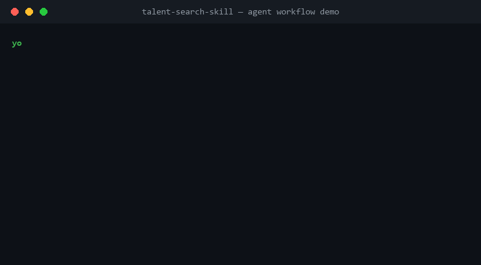

# talent-search-skill

> An Agent Skill for end-to-end **AI / quant talent sourcing** — input a candidate persona or JD, get back a cross-verified **Excel candidate list** plus a full **search log**.

Works with Claude Code, WorkBuddy, and any AI Agent host that follows the `SKILL.md` spec.




## Why use it

1. **Four-channel parallel search** — academia (papers / labs / competitions), GitHub (open-source contributors), company (team pages / tech blogs), community (public pages on Zhihu, LinkedIn, Maimai). All four channels fire at once.
2. **Cross-verification discipline** — every candidate goes through at least one round of primary-source verification (single-pass, mandatory). For critical roles you can switch on **five-pass verification** — five independent dimensions (academia, GitHub, professional platforms, company primary sources, personal homepage) corroborate each other; conflicts defer to primary sources.
3. **Better empty than fabricated** — anything not backed by primary sources is marked "to be verified / not obtained". No fabrication. Every key fact is traceable to a source URL in the search log.
4. **Zero-dependency Excel output** — built-in `gen_excel.mjs` (Node ≥ 18, no third-party packages) writes a fixed 9-column sheet: name / education / internships-and-jobs / personal homepage / GitHub / first-author papers / university-lab experience / match highlights / notes (CV and contact).
5. **A candidate library that grows with you** — every round's results land in `talent-research/_db/candidates.jsonl`. The next round in the same direction queries the library first for incremental updates: anything verified within 90 days is reused, anything rejected is skipped. Paired with `db_upsert.mjs` (zero-dependency `upsert` / `search` / `stats` commands).
6. **Self-improving experience** — every round ends with an automatic retrospective. Source effectiveness, rejection patterns, network pitfalls, and process improvements get appended to monthly files in `talent-research/_lessons/`. The next round reads the last two months of lessons and tunes its strategy.
7. **Evaluation baseline (brake on evolution)** — built-in `eval_recall.mjs` scores every revision against a golden set: recall threshold 0.8; school and current-role field accuracy must not regress. A revision is only allowed to merge if the gate holds — so "self-improvement" can't drift into "self-destruction".
8. **Proactive radar (scheduled monitoring)** — `radar_scan.mjs` runs weekly, scanning target companies' GitHub org member changes plus OpenAlex new papers (with first-author and institution). Incremental signals auto-compose a report. From "search when asked" to "proactive talent radar". Ships with a built-in lookup table for 16 China-side LLM-team orgs (Qwen / DeepSeek / Zhipu / Kimi / ModelScope / Tongyi / Tencent ARC & Hunyuan / ByteDance Seed / PaddlePaddle / Noah's Ark Lab / MindSpore / Meituan / JD / RedNote / Xiaohongshu).
9. **School tiering built in** — C9 / Hong Kong / overseas school tier table and well-known-lab criteria are wired in, so the skill can shortlist by school bar without you re-pasting the list.

## Workflow

```
Persona / JD
   │
   ▼
Step 0  Parse persona → query candidate library (incremental reuse) → read last two months of lessons
   │
   ▼
Step 1  Four-channel parallel search  ──→  8–15 candidate lead cards
   │
   ▼
Step 2  Dedupe + cross-verify → write back to candidate library
   │        ├─ Single-pass (mandatory): primary-source check on school / current role / contact
   │        └─ Five-pass (optional): academia / GitHub / professional platform / company / personal homepage
   │
   ▼
Step 3  Produce candidates-YYYYMMDD.xlsx + search-log.md
   │
   ▼
Step 4  Retrospective  ──→  lessons appended to _lessons/, next round reuses them
```

## Install

**Claude Code** (user-level, available globally):

```bash
git clone https://github.com/cw20051219-commits/talent-search-skill ~/.claude/skills/talent-search
```

Or project-level (current project only):

```bash
git clone https://github.com/cw20051219-commits/talent-search-skill .claude/skills/talent-search
```

**WorkBuddy**:

```bash
git clone https://github.com/cw20051219-commits/talent-search-skill ~/.workbuddy/skills/talent-search
```

**Other Agent hosts** — copy this folder to the host's skills directory. The skill format is a generic `SKILL.md` + frontmatter spec.

Requirement: Node.js ≥ 18 (only used for the Excel generator and the candidate library; zero third-party dependencies).

## Usage

After install, just talk to your agent, for example:

> Find me 20 candidates for LLM pre-training data roles: PhD 2021–2024, C9 or overseas schools, currently based in China.

Or hand it a benchmark persona / JD:

> Here is our benchmark persona (in the examples/persona.example.md format). Find people like this.

The agent drops into the skill flow automatically. You can also craft inputs by hand using the persona template and `candidates.example.json` under `examples/`.

## Repo structure

```
talent-search-skill/
├── SKILL.md                    # Main directive: 5-step flow (query / write-back / retrospective) + verification discipline + output spec
├── references/
│   ├── source-playbook.md      # Four-channel search strategy and contact-collection rules
│   ├── school-list.md          # C9 / HK / overseas school tier table and well-known-lab criteria
│   └── lessons-template.md     # Retrospective entry format (four entry types)
├── scripts/
│   ├── gen_excel.mjs           # Zero-dependency xlsx writer (fixed 9 columns)
│   ├── db_upsert.mjs           # Zero-dependency candidate library (upsert / search / stats)
│   ├── eval_recall.mjs         # Zero-dependency golden-set evaluation (recall + field-accuracy gate)
│   └── radar_scan.mjs          # Zero-dependency proactive radar (GitHub org members + OpenAlex paper delta)
├── assets/
│   └── demo.gif                # Workflow demo (fictional data only)
└── examples/
    ├── persona.example.md        # Three-section persona template (fictional people)
    ├── candidates.example.json   # Excel input data structure
    ├── db-candidates.example.jsonl  # Candidate library schema (fictional people)
    ├── golden.example.jsonl      # Golden-set format (fictional people)
    └── radar-config.example.json  # Proactive-radar config
```

## Compliance

- This skill only collects **publicly available information** (GitHub profile emails, personal-homepage emails, paper corresponding-author emails, public LinkedIn pages). No paid databases, no closed-group scraping.
- The candidate data it produces is personal information. You are responsible for using it lawfully (e.g. legitimate recruiting) and for complying with the personal-data laws of your jurisdiction (e.g. PIPL, GDPR, etc.).
- The user of this tool bears all compliance responsibility.

## License

[MIT](./LICENSE)
